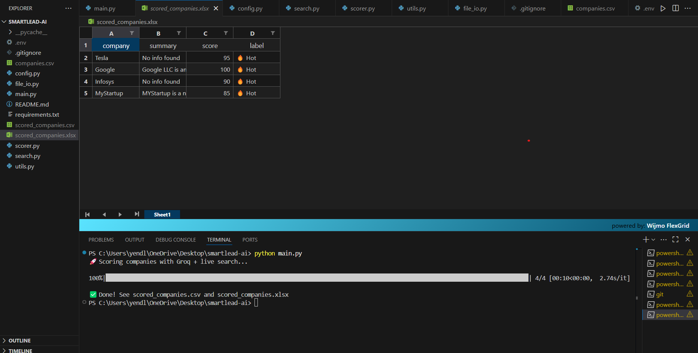

# 🔍 SmartLead AI – AI-Powered Lead Scoring Tool using Groq & SerpAPI

SmartLead AI is an AI-powered lead scoring tool that uses live web data and Groq's lightning-fast LLM (LLaMA 3 70B) to analyze and score companies in real time.  
It intelligently evaluates companies based on online search data, using both custom heuristics and large language models to predict how promising each lead is.

---

## 🚀 Project Features

- 🔎 **Live Company Info Search** – Uses [SerpAPI](https://serpapi.com/) to fetch fresh Google search results for each company.
- 🧠 **AI Scoring Engine** – Powered by [Groq's LLaMA 3 70B model](https://console.groq.com/) for ultra-fast, intelligent evaluation.
- 📝 **Custom Prompts** – Each company is scored using a context-rich prompt sent to the LLM.
- 📊 **Outputs to Excel & CSV** – Clean and ready for client/team usage.
- 🔐 **Secure API Keys** – All sensitive data is stored in a `.env` file.

---

## 📂 Project Structure
smartlead-ai/
├── main.py # 🔁 Entry point – loops through companies and scores them
├── scorer.py # 🧠 Creates prompts and handles scoring with Groq LLM
├── search.py # 🔎 Uses SerpAPI to fetch Google search results
├── config.py # 🔐 Loads API keys from .env file
├── file_io.py # 📁 Handles reading/writing Excel and CSV files
├── utils.py # 🧹 Helper functions (cleaning, formatting, etc.)
├── requirements.txt # 📦 Python dependencies
├── README.md # 📘 You're reading it!
├── companies.csv # 🏢 Input file: list of companies to score
├── images/
│ └── excel.png # 📸 Screenshot of Excel output
